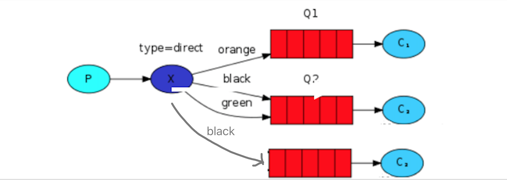

路由模式是可以根据路由键选择性给多个消费者发送消息的模式，
它包含一个生产者、多个消费者、多个队列和一个交换机。
多个消费者同时绑定到不同的队列上去，
多个队列通过路由键绑定到交换机上去，
生产者发送消息到交换机，
交换机通过路由键转发到不同队列，
队列绑定的消费者接收并消费消息。

为什么 X 到 Q2 要有 black，green，2个 binding key呢，一个不就行了吗？ 
这个主要是因为可能又有 Q3，而Q3只接受 black 的信息，而Q2不仅接受black 的信息，还接受 green 的信息

生产者发送消息到交换机,同时绑定一个路由Key,交换机根据路由key对下游绑定的队列进行路
由key的判断,满足路由key的队列才会接收到消息,消费者消费消息

应用场景: 项目中的error报错
