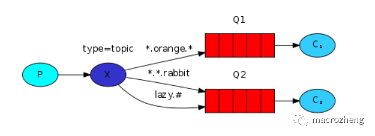

RabbigMQ消息模式——发布/订阅模式

通配符模式是可以根据路由键匹配规则选择性给多个消费者发送消息的模式，
它包含一个生产者、两个消费者、两个队列和一个交换机。
两个消费者同时绑定到不同的队列上去，两个队列通过路由键匹配规则绑定到交换机上去，生产者发送消息到交换机，交换机通过路由键匹配规则转发到不同队列，队列绑定的消费者接收并消费消息。

特殊匹配符号
```
*：只能匹配一个单词；
#：可以匹配零个或多个单词。
```



应用场景:
