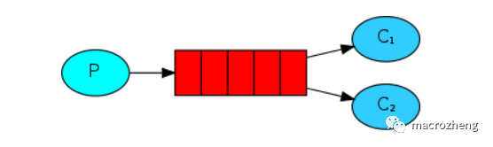

RabbigMQ消息模式——工作模式

工作模式是指向多个互相竞争的消费者发送消息的模式，它包含一个生产者、多个消费者和一个队列。多个消费者同时绑定到一个队列上去，当一个消费者获取消息处理耗时任务时，空闲的消费者从队列中获取并消费消息。

多个消费者同时监听同一个队列,消息如何被消费?(与具体的分发方式有关系)
C1,C2共同争抢当前消息队列的内容,谁先拿到消息,谁来负责消费

应用场景:红包;大型项目中的资源调度过程(直接由最空闲的系统争抢到资源处理任务)